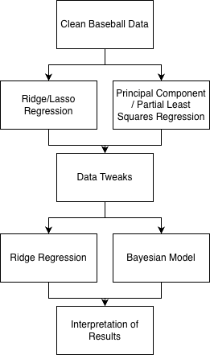

# Data Science Final Project - UCL Prediciton 

A data-driven analysis of Tommy John injury in the MLB between 2018 and 2024, with the goal of predicitng Tommy John injury.

## Overview

- This research project investigates potential correlating factors between pitches thrown and pitchers who undergo Tommy John surgery (ulnar collateral ligament reconstruction). The study employs both traditional machine learning models and bayesian approaches to build a strong framework to better predict Tommy John Injury.
- Machine Learning models were used as preliminarily methods to root out predictors that had limited impact upon predicting Tommy John Surgery. The focus of this study was on 'common' pitch types like fastball, slider, and curveball to build a framework that could predict if a certain ball came from a injured pitcher or not.
- All of the preliminary work with the machine learning models was used to build a strong Bayesian Regression Model for predicitng injury outcomes, which had mixed results.

**Research Presentation:** 
- Preliminary findings were presented at the Conneticut Sports Analytics Symposium (CSAS) 2026 at UCONN and Belmont SPARK 2026.
  - You can find the SPARK presenation attached to this github page as well. 

## Features

- **Data Collection & Processing**: Automated web scraping and data cleaning pipelines using BaseballR
- **Statistical Modeling**: Multiple analytical approaches including:
  - Multiple Linear Regression
  - Logistic Regression
  - Shrinkage and Variable Importance 
    - LASSO / Ridge Regression
    - Priniciple Component Regression
    - Partial Least Squares Regression
    - SHAP
  - Random Forest
  - Bayesian Regression Model using STAN (BRMS)
- **Additional Resources**
  - For information on visual outputs (besides looking at the code), please check out the `Spark_Presenation.pdf` for a selection of model outputs. 

## Repository Structure

```
├── Baseball_Basics.R          # Data gathering and cleaning scripts
├── MachineLearningModels.qmd  # Pitch Analysis and Prediction using Machine Learning 
├── ProjectProposal.pdf        # Project Outline and semester long goals
├── RegressionBoundaries.qmd   # Model tuning 
├── SPARK_Presenation.pdf      # Project Presenation
├── data_smaller.csv           # Data used for project
├── AdvancedTopics             # Credit Section for class
└── data_completed_na.csv      # A cleaned version of data_smaller.csv

```

## Technologies Used

### R Environment
- **BaseballR**: MLB data acquisition and processing
- **BRMS**: Bayesian statistical modeling and inference
- **tidyverse**: Data manipulation and visualization
- **ISLP**: Machine Learning Models

### Running Statistical Analysis

Open and execute the R files in RStudio or your preferred R environment:
1. Start with `Baseball_Basics.R` for data preparation
2. Explore `MachineLearningModels.qmd` and `RegressionBoundaries.qmd` for model framework development and outputs.

## Methodology

The research pipeline consists of:

1. **Data Collection**: Aggregating pitcher statistics and Tommy John surgery records using BaseballR, all active pitchers between 2018 and 2024 were used. If a pitcher had Tommy John Surgery within this time frame, pitchers were collected from two years prior to the surgery itself. All other pitchers had data collected for pitches thrown between 2018 and 2024. Check out `Baseball_Basics.R` to see how data was collected.
3. **Feature Work**: A variety of machine learning technqiues were used to select features of possible significance, and drop those that had limited or no impact upon prediction outcomes. 
   - LASSO/Ridge Regression : Variable shrinkage to remove redundant/useless predictors
   - PCR/PLS : Variable selection to cross-validate dropped predictors with LASSO/Ridge Regression output.
   - SHAP : Resolve multicollinearity problem by looking each predictor individually to better understand useful and useless predictors.
4. **Final Implementation**: After the feature work was completed, and redundant information was dropped, a random forest and BRMS model were build to get the final results.
5. **Interpretation**: Detailed look into the outputs given across the board to understand what predcitors had the biggest impact upon a pitcher having to get Tommy John Surgery.

### Methodology Image

This image gives you a idea of the framework used to build the results for interpretation, note the multiple models used to build the best data possible.

## Key Findings

The project identifies correlations between specific pitching patterns and Tommy John surgery risk, with the Bayesian hierarchical model providing probabilistic predictions that account for individual pitcher characteristics and uncertainty in the data.

## Future Work

The goal of future work is to look at the interaction terms between different types of baseball pitches, since pitchers usually have a collection of pitches they thrown and not just one. The interaction between these terms will hopefully faciliate the better predicition of injury and when it will occur, because since we know that individual pitch types lead to surgery, pitch types together should also lead to surgery.

## Contact

**LinkedIn**: www.linkedin.com/in/brady-pinter
